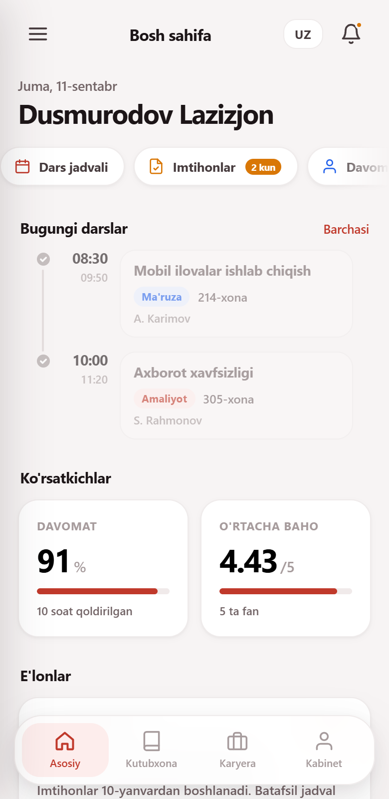
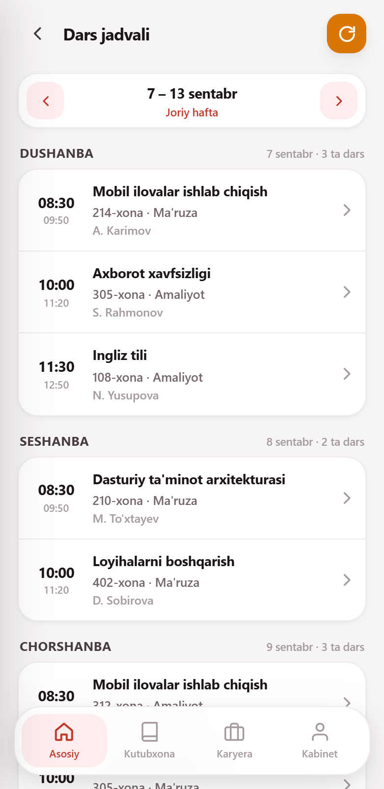
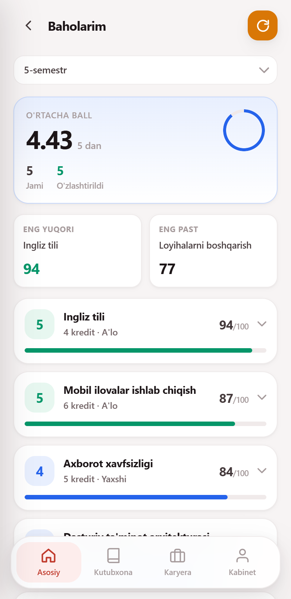
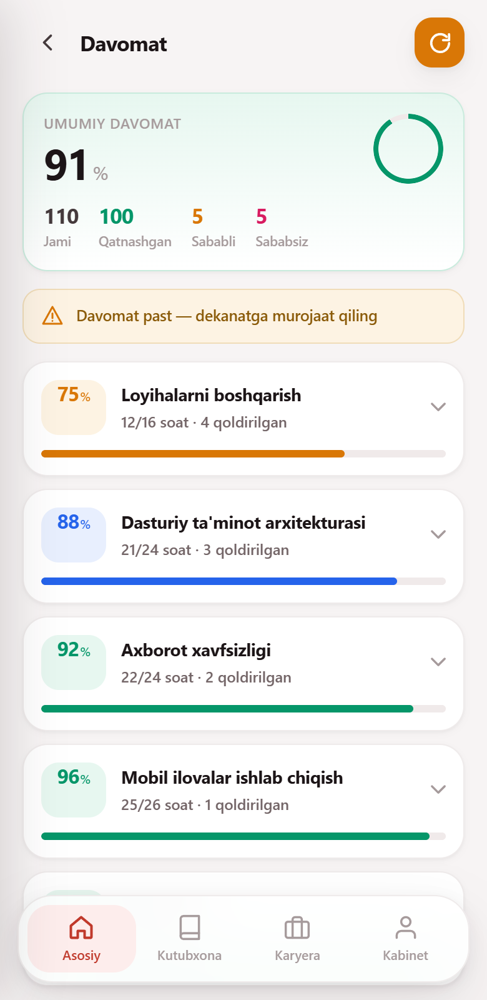
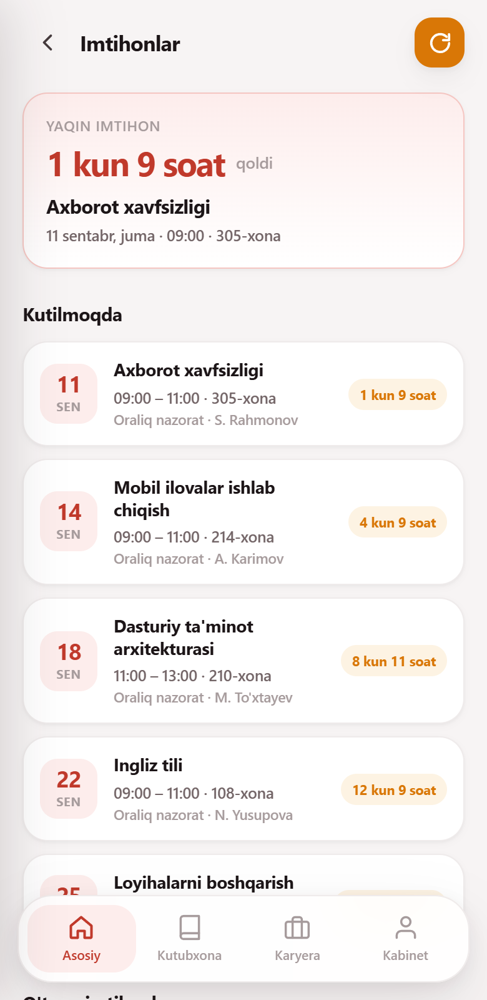
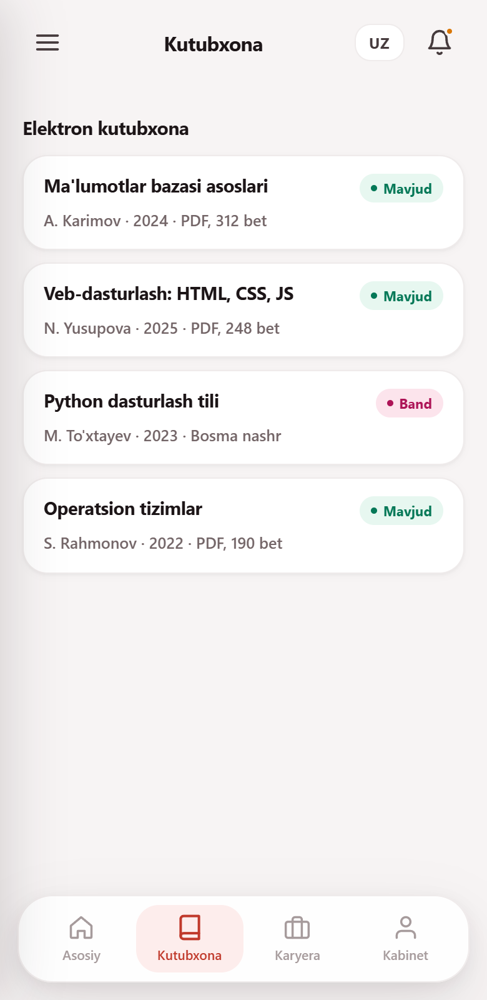
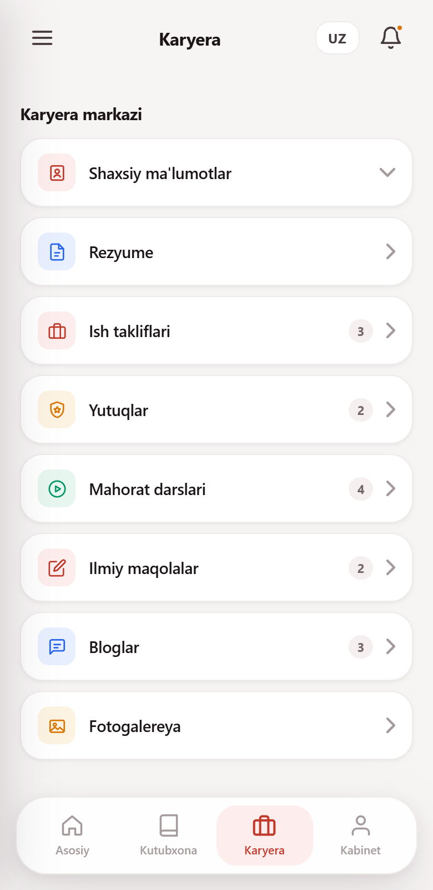
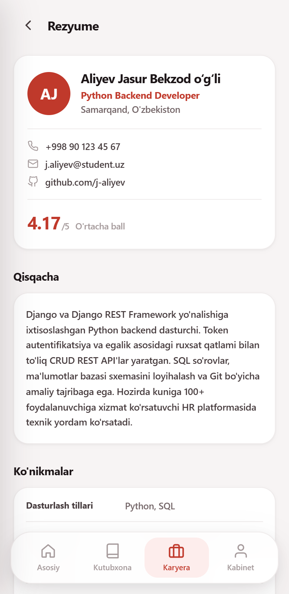
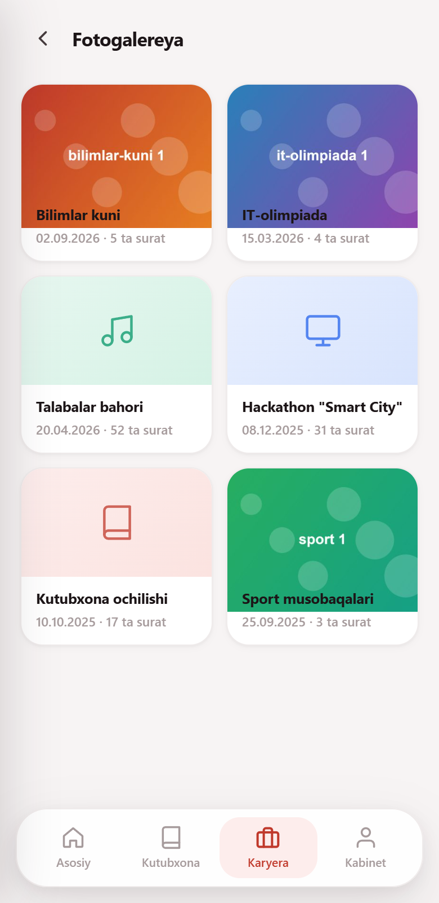
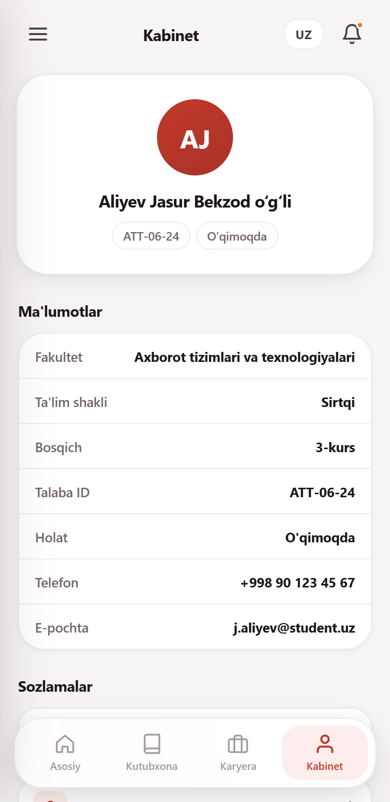

# MyStudent — talaba kabineti

Talabalar uchun mobil veb-ilova: dars jadvali, davomat, baholar, imtihonlar,
kutubxona va karyera bo'limlari bitta joyda. O'zbek, rus va ingliz tillarida.

### 👉 [Ilovani ochish](https://mystudent-lspe.onrender.com)

To'liq versiya: backend, ma'lumotlar bazasi, dekanat paneli.
Telefondan ham, kompyuterdan ham ochiladi.

> Bepul hostingda server 15 daqiqa harakatsizlikdan keyin uxlaydi —
> birinchi ochilish ~50 soniya olishi mumkin, keyingilari tez.

Faqat interfeysni tez ko'rish uchun —
[statik demo](https://lazizjondusmurodov-create.github.io/mystudent/)
(darhol ochiladi, lekin serversiz: ariza yuborish saqlanmaydi, dekanat
paneli ishlamaydi).

**Nima bor:** haqiqiy backend (Node.js), doimiy ma'lumotlar bazasi
(PostgreSQL), token bilan himoya, dekanat paneli, uch til, qorong'i
rejim, internetsiz ishlash (PWA).

Boshqarish qo'llanmasi — ma'lumot almashtirish, dekanat kodi, baza,
domen ulash — [QOLLANMA.md](QOLLANMA.md) da.

## Ekranlar

| Bosh sahifa | Dars jadvali | Baholar |
|---|---|---|
|  |  |  |

| Davomat | Imtihonlar | Kutubxona |
|---|---|---|
|  |  |  |

| Karyera | Rezyume | Fotogalereya |
|---|---|---|
|  |  |  |

| Kabinet | | |
|---|---|---|
|  | | |

## Imkoniyatlar

- **Kirish** — telefon raqam bilan; parol so'ralmaydi
- **Dars jadvali** — haftalik ko'rinish, joriy kun ajratilgan, dars tafsilotlari
- **Davomat** — foiz, qoldirilgan soatlar, fanlar bo'yicha tafsilot
- **Baholar** — semestr bo'yicha, o'rtacha ball, kredit va eng yuqori/past fanlar
- **Imtihonlar** — jadval va qolgan kunlar hisoblagichi
- **Qarzdorlik** — akademik va shartnoma bo'yicha, ariza yuborish
- **Dekanat paneli** — kelgan arizalarni ko'rish, qabul qilish yoki rad etish
- **Yotoqxona** — joy holati va ariza
- **Kutubxona** — kitoblar ro'yxati va qidiruv
- **Karyera** — rezyume, ish takliflari, yutuqlar, mahorat darslari, maqolalar, bloglar
- **Fotogalereya** — tadbirlar albomlari; surat to'liq ekranda ochiladi, barmoq bilan suriladi
- **Uch til** — o'zbek, rus, ingliz (yuqori o'ngdagi tugmadan almashtiriladi)
- **Qorong'i rejim** — Sozlamalar → Ko'rinish: tizim bo'yicha, yorug' yoki qorong'i
- **Internetsiz ishlaydi** — telefon ekraniga o'rnatiladi (PWA)

## Ishga tushirish

Qurish (build) bosqichi yo'q. Node.js 18+ bo'lsa kifoya:

```bash
node server/server.js
# brauzerda: http://localhost:3000
```

Bu to'liq versiya — API, kirish, dekanat paneli ishlaydi.

Faqat interfeysni ko'rish uchun serversiz ham ochsa bo'ladi — u holda
ma'lumot `data/*.json` dan o'qiladi, ariza yuborish saqlanmaydi:

```bash
python -m http.server 8899
```

## Namuna kirish

Ilovadagi ma'lumot — namuna. Kirish uchun telefon raqamning o'zi
yetarli, parol so'ralmaydi.

| Telefon | Kod | Talaba | Guruh |
|---|---|---|---|
| `505816667` | `1111` | Dusmurodov Lazizjon | ATT-06-24 |
| `901234567` | `2024` | Aliyev Jasur | ATT-06-24 |
| `912345678` | `3050` | Yusupova Nilufar | KIF-04-25 |
| `937778899` | `7788` | Rahmonov Sardor | IQT-02-23 |

Raqamni istalgan shaklda kiritsangiz bo'ladi — `+998 90 123 45 67` ham,
`901234567` ham, `0901234567` ham ishlaydi.

Namuna rejimida raqamlar kirish ekranida ro'yxat bo'lib ko'rinadi —
bosish kifoya. `DEMO=off` bilan ro'yxat yashiriladi.

Kod ustuni — eski usul uchun (kirish ekranida «Kirish kodi bilan
kirish»); `KOD_KIRISH=off` bilan o'chiriladi.

### Dekanat paneli

`DEKANAT_KODI` (odatiy `9999`) bilan kirilsa — barcha talabalarning
arizalari ko'rinadi, har biriga qabul/rad javobi beriladi. Javob bazaga
yoziladi va arizani yuborgan talaba uni o'z qurilmasida ko'radi.

## Tuzilishi

```
index.html      — sahifa tuzilmasi va meta teglar
api.js          — API qatlami: ma'lumot shu yerdan olinadi
app.js          — butun mantiq: tillar, sahifalar, ko'rinish
style.css       — uslublar (ranglar CSS o'zgaruvchilarida)

server/
  server.js     — backend: API va statik fayllar
  baza.js       — PostgreSQL qatlami (DATABASE_URL bo'lsa)
  raqam.js      — telefon raqamni yagona ko'rinishga keltirish
  db.json       — asosiy ma'lumot manbai

data/           — statik rejim uchun ma'lumot (server bo'lmaganda)

manifest.json   — PWA sozlamalari
sw.js           — service worker: internetsiz ishlash
404.html        — topilmadi sahifasi (mustaqil, style.css ga bog'liq emas)
robots.txt      — qidiruv tizimlari uchun
sitemap.xml     — sayt xaritasi
render.yaml     — hosting sozlamasi (Render)
docs/           — README uchun skrinshotlar
  foto/         — galereya suratlari (tools_foto.js yasaydi)
rasmlar/        — galereyaning asl rasmlari (GitHub'ga yuborilmaydi)

tools_check.js  — versiya, kesh, manifest, tarjima kalitlarini tekshiradi
tools_sinov.js  — ma'lumotni tekshiradi: takroriy kodlar, yetishmayotgan
                  maydonlar, db.json va data/ orasidagi farq
tools_shot.js   — skrinshotlarni avtomatik yangilash
tools_foto.js   — galereya rasmlarini tayyorlaydi (kichraytiradi va
                  ro'yxatga yozadi); qo'llanma: rasmlar/OQING.md
```

**Ikki hujjat:** [README.md](README.md) — texnik tavsif (shu fayl),
[QOLLANMA.md](QOLLANMA.md) — kundalik boshqaruv.

## Chiqarishdan oldin

```bash
node tools_check.js    # versiya, kesh, manifest, tarjima kalitlari
node tools_sinov.js    # ma'lumot: kodlar, id lar, ikki manba mosligi
```

**Muhim:** `style.css` yoki `app.js` o'zgarsa, `?v=` raqamini
[index.html](index.html) **va** [sw.js](sw.js) da bir xil qilib yangilang,
hamda `sw.js` dagi `VERSIYA` ni ko'taring — aks holda foydalanuvchida
eski nusxa qolib ketadi. `tools_check.js` shuni tekshiradi.

## Backend (API server)

Loyihada haqiqiy backend bor — `server/server.js`. Node.js'da yozilgan,
veb-server uchun tashqi kutubxona ishlatilmaydi (faqat o'rnatilgan `http`).

```bash
node server/server.js
# so'ng brauzerda: http://localhost:3000
```

Ma'lumotlar `server/db.json` faylida. Ariza yuborilsa faylga yoziladi va
server qayta ishga tushsa ham qoladi.

**Bulutda** (`DATABASE_URL` berilganda) arizalar PostgreSQL'ga yoziladi —
bepul hostingda disk vaqtinchalik bo'lgani uchun. Buning uchun bitta
kutubxona kerak: `pg`. Mahalliy ishlashda u ishlatilmaydi, shuning uchun
`npm install` qilmasangiz ham server ishlayveradi.

### Muhit o'zgaruvchilari

| Nomi | Nima qiladi | Odatiy |
|---|---|---|
| `PORT` | Port | `3000` |
| `DATABASE_URL` | PostgreSQL. Bo'lmasa `db.json` ishlatiladi | — |
| `DEMO` | `off` — kirish kodlari ro'yxati yashiriladi | `on` |
| `DEKANAT_KODI` | Dekanat paneli kodi | `9999` |
| `KOD_KIRISH` | `off` — 4 xonali kod bilan kirish o'chadi | `on` |

### Kirish va himoya

```
POST /api/login  {telefon:"901234567"}  →  {token, talaba}
POST /api/login  {kod:"2024"}           →  {token, talaba}
```

Asosiy usul — **telefon raqam**. Parol so'ralmaydi: raqamning o'zi
kirish kaliti.

> **Diqqat:** bu kirishni ochiq qoldiradi. Telefon raqam maxfiy
> ma'lumot emas — uni bilgan har kim o'sha talabaning baholari,
> davomati va arizalarini ko'ra oladi. Namoyish uchun qulay, haqiqiy
> talabalar ma'lumoti uchun yetarli emas.

Bitta raqamdan 5 marta topilmagan urinishdan keyin 15 daqiqaga blok —
bu faqat raqamlarni ketma-ket terib qidirishni sekinlashtiradi.

4 xonali kod — eski usul; `KOD_KIRISH=off` bilan o'chiriladi.
Dekanat kodi undan qat'i nazar ishlayveradi.

Token olingandan keyin himoyalangan endpointlarga `Authorization: Bearer <token>`
sarlavhasi bilan murojaat qilinadi. Tokensiz ular **401** qaytaradi.

### Ikki rejim

Ilova o'zi aniqlaydi qaysi rejimda ishlashini:

| Rejim | Qachon | Ma'lumot manbai |
|---|---|---|
| **Server** | backend ishlab tursa | `/api/...` |
| **Statik** | server bo'lmasa | `data/*.json` fayllari |

Statik rejimda ariza yuborish va dekanat paneli ishlamaydi — u faqat
interfeysni ko'rsatish uchun. Telefon raqam bilan kirish esa u yerda
ham ishlaydi: raqamlar `data/talabalar.json` da turadi.

Majburiy tanlash uchun [api.js](api.js) da `API_REJIM` ni `'server'`
yoki `'statik'` qiling. Boshqa domendagi serverga ulash uchun `API_BASE`
ni to'ldiring.

### Endpointlar:

| Manzil | Qaytaradi |
|---|---|
| `GET /talabalar` | `{talabalar:[...]}` |
| `GET /jadval` | `{semestrlar:[...], darslar:[...]}` |
| `GET /imtihonlar` | `{imtihonlar:[...]}` |
| `GET /davomat` | `{davomat:[...]}` |
| `GET /baholar` | `{baholar:[...]}` |
| `GET /yangiliklar` | `{yangiliklar:[...]}` |
| `GET /kutubxona` | `{kitoblar:[...]}` |
| `GET /ishlar` | `{ishlar:[...]}` |
| `GET /qarzdorlik` | `{yillar, akademik, arizalar, shartnoma}` |
| `GET /fotolar` | `{fotolar:[...]}` |
| `GET /yotoqxona` | `{yotoqxona:{...}}` |
| `POST /arizalar` | yangi ariza yozadi → `{ariza}` |
| `GET /salom` | hayot belgisi → `{holat, vaqt, baza}` |

Token talab qilmaydiganlar: `yangiliklar`, `kutubxona`, `ishlar`,
`fotolar`, `salom`.

**Dekanat** (`DEKANAT_KODI` bilan kirgan):

| Manzil | Qaytaradi |
|---|---|
| `GET /dekanat/arizalar` | barcha talabalarning arizalari |
| `POST /dekanat/holat` | `{id, holat}` — qabul (`ok`) yoki rad (`no`) |

Oddiy talaba bu yo'llarga kira olmaydi.

Barcha so'rovlar parallel ketadi. Ma'lumot kelguncha yuklanish ekrani
turadi; xato bo'lsa — sabab va "Qayta urinish" tugmasi ko'rsatiladi.

### API'ni qo'lda sinash

```bash
# kirish
curl -X POST http://localhost:3000/api/login   -H "Content-Type: application/json" -d '{"kod":"2024"}'

# tokensiz — 401
curl http://localhost:3000/api/baholar

# token bilan
curl http://localhost:3000/api/baholar -H "Authorization: Bearer <TOKEN>"
```

## Mavzu (yorug'/qorong'i)

Ilova ichida: **Sozlamalar → Ko'rinish** — uch variant bor:

| Variant | Nima qiladi |
|---|---|
| Tizim bo'yicha | telefon sozlamasiga moslashadi (standart) |
| Yorug' | doim yorug' |
| Qorong'i | doim qorong'i |

Tanlov `localStorage` da (`ms.theme`) saqlanadi. Ranglar `style.css`
boshidagi CSS o'zgaruvchilarida yig'ilgan — mavzu shu tokenlarni
almashtirish orqali ishlaydi.

## Skrinshotlarni yangilash

```bash
npm i puppeteer-core
python -m http.server 8899    # boshqa terminalda
node tools_shot.js
```

Yangi sahifa qo'shilsa, [tools_shot.js](tools_shot.js) ichidagi `SAHIFALAR`
ro'yxatiga uning `tab` va `data-key` qiymatlari yoziladi.
